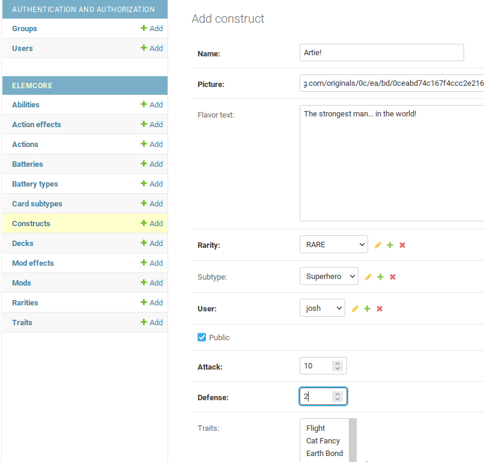

# PROTOTYPE Elementals Card Creation Engine (ECCE)
This project is a proof-of-concept card creation engine for the Elementals trading card game.  

## Game Concept
Many players of trading card games such as MTG like the idea of creating their own custom cards.  There are many web sites and applications capable of this, however the cards created cannot be legally used in play as they have not been balanced or approved by the MTG team.

The idea behind Elementals is that ALL cards are custom cards.  Players can create their own unique cards with their own mixture of stats, abilities and art.  The Elementals Card Creation Engine (ECCE) is the system that specifies and enforces the rules on a card-by-card basis, allowing players to create new cards that are all limited and balanced by the ECCE.

All traits, abilities, effects, etc are determined and balanced by ECCE.  Card creators can "drag and drop" their desired attributes onto cards, with ECCE enforcing cost limits.

The end result could be described as "Sure, you can have a 100/100 Dragon construct with Flight and 10x Fire Breath that can deal 50 damage per turn, but it'll cost so much you'll literally never get to cast it."

## Examples
Bob decides that his deck needs a 5/5 construct ("creature") with Flight.  By entering the base stats of 5/5, ECCE will apply a base cost of "5" to this construct (attack + defense, divided by 2, rounded up if necessary).  By applying the Flight trait from ECCE, the cost goes up by (for example) 2 AIR batteries.  Bob's card now costs 5 (any battery)+Air+Air.

Jane wants to add a Mod ("enchantment") to her deck.  A Mod has no base cost, but any Mod Effects applied to it in ECCE will.  She decides to call her Mod "Laser Field" and add the "Constructs without Flight cannot attack" effect, which ECCE has set at a cost of 3 CHAOS batteries.  Jane can now create her Laser Field card and it will cost 3 CHAOS to cast.  If she wishes, Jane can add additional effects to the Laser Field card, and ECCE will adjust the card's casting cost accordingly.

# Card Creation
## ECCE admin area
There are two possible ways to create cards.  The first and most capable is through the Admin area, which is just a moderately customized implementation of the standard Django admin area.  This gives direct access to the data behind all cards, mods, effects, etc.

This is (by design) the ONLY way to create and manage ECCE-controlled resources such as traits and abilities.  Anything that impacts card cost is under the jurisdiction of the ECCE rules.



The cost rules are enforced at the model-level (see ```elemcore/models.py``` for details) once the stats and attributes are entered.

## User-facing card creator
Once a set of Traits, Abilities, and Mod Effects have been entered into ECCE by admins, users can interact with the public side of the card creator, which allows them to select from ECCE-balanced options to create their card.  

This portion of the project is in VERY early stages.  Currently, all data is best entered and edited in the Admin area. 


Once completed, the new card is saved under the user's profile and can be reviewed (soon edited) from there.  

